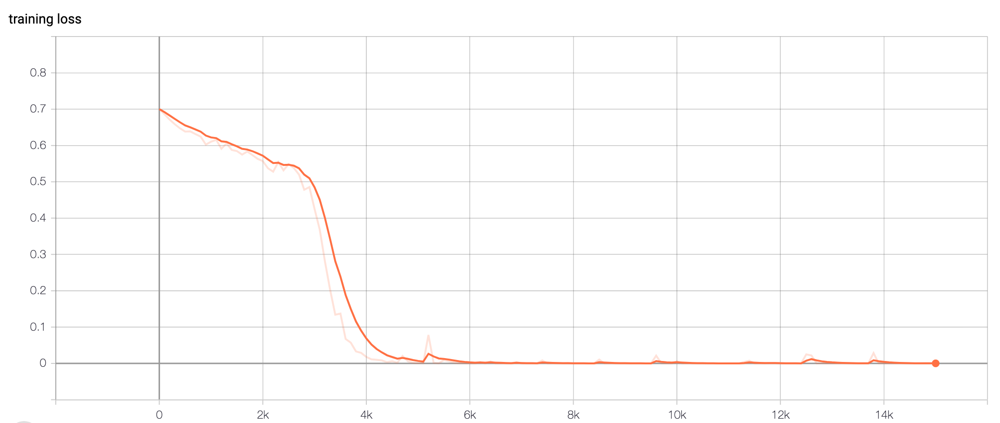

# Blind Memory with ntm - Neural Turing Machines in pytorch

Uses [Neural Turing Machines](https://arxiv.org/abs/1410.5401) implementation in pytorch to try out blind Memory concept. 

Blind memory is simply a discrete location based method of reading/writing from memory in constant time. Current experiments reveal the hard to train nature of it and infeasibility of it without extensive pre-training. 


## Copy task

The copy task tests whether NTM can store and recall a long sequence of arbitrary information. The network is presented with an input sequence of random binary vectors followed by a delimiter flag. The target sequence is a copy of the input sequence. No inputs are presented to the model while it receives the targets, to ensure that there is no assistance.

The model is trained on sequences of 1 to 20 8-bit random vectors. In less than 50k iterations, the model usually becomes really accurate.

Here is the net output compared to the target for a sequence of 20.


Here is the net output compared to the target for a sequence of 100. Note that the network was only trained with sequences of 20 or less.


Here is an example (seed=1) of loss during training, with a batch size of 8.


## Repeat copy task

As said in the paper, "the repeat copy task extends copy by requiring the network to output the copied sequence a specified number of times and then emit an end-of-sequence marker. [...]
The network receives random-length sequences of random binary vectors, followed by a scalar value indicating the desired number of copies, which appears on a separate input channel. To emit the end marker at the correct time the network must be both able to interpret the extra input and keep count of the number of copies it has performed so far. As with the copy task, no inputs are provided to the network after the initial sequence and repeat number."

The model is trained on sequences of 1 to 10 8-bit random vectors, with a repeat between 1 and 10.

Here is the model output for a sequence of 10 and a repeat of 10.


Here it is for a sequence of 10 and a repeat of 20. Note that the network was trained with a repeat of 10 max.


Here it is for a sequence of 20 and a repeat of 10. Maybe it needs a bit more training here! Note that the network was trained on sequences of 10 or less.


Training on the repeat copy task takes substantially longer than the copy task. It usually takes at least 100k iterations to start seeing good results.

## Usage

```bash
# installation
pip install -r requirements.txt
# to train
python copy_task.py --train
# to evaluate
python copy_task.py --eval

```

### References

1. Graves, Alex, Greg Wayne, and Ivo Danihelka. "Neural turing machines." arXiv preprint arXiv:1410.5401 (2014).
1. https://github.com/loudinthecloud/pytorch-ntm/
2. https://github.com/MarkPKCollier/NeuralTuringMachine
